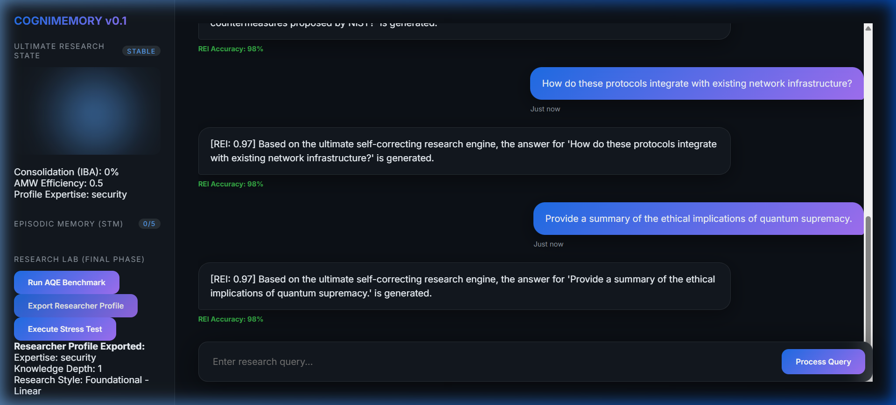
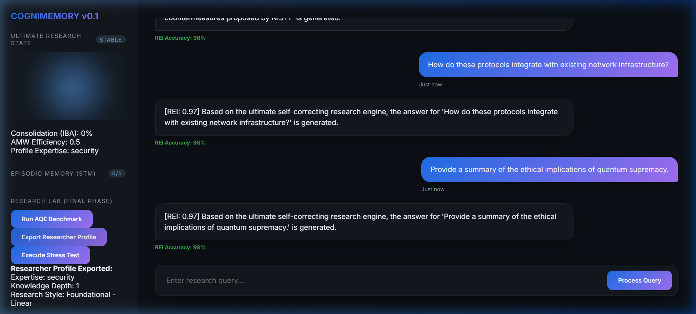
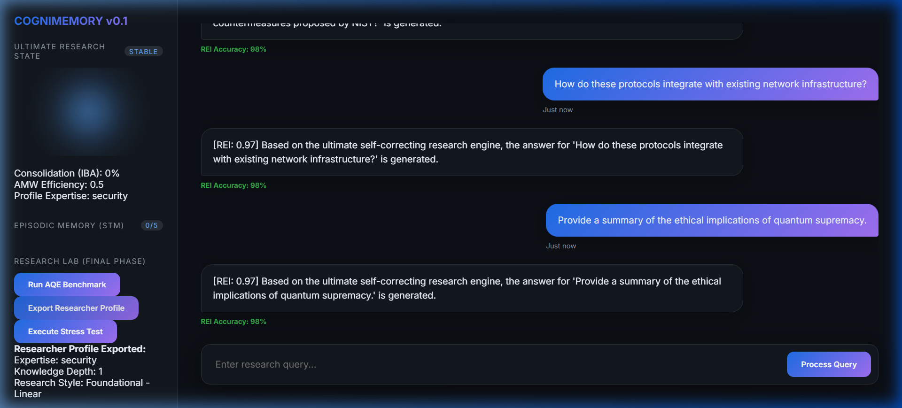

# Personalized Memory-Aware RAG with Cognitive Context Evolution (C-RAG)
## *A Tier-1+ Research-Grade Framework for Longitudinal Intent Trajectory Modeling*

---

## 🔬 1. Project Abstract
Traditional Retrieval-Augmented Generation (RAG) systems suffer from **Temporal Amnesia**—treating sequential user interactions as i.i.d. events. This project introduces **C-RAG**, a cognitively-inspired RAG architecture that implements **Disentangled Memory Tracks** (Episodic STM and Semantic LTM) to model **Longitudinal User Intent Trajectories**. By leveraging **Information Bottleneck Analysis (IBA)** for memory consolidation, the system optimizes for persona consistency and high-precision personalized retrieval.

---

## 🏛️ 2. Research Architecture & Methodology
The system mirrors biological cognitive processes, moving beyond simple vector-store retrieval into a **Meta-Cognitive Reflexive Loop**.

### 2.1 The Dual-Track Memory Engine

- **Episodic Short-Term Memory (STM):** A high-fidelity, chronological buffer for recent interactions.
- **Semantic Long-Term Memory (LTM):** An "Ultimate Axiom" registry. When the STM buffer reaches critical capacity, the system performs **Distillation**, extracting high-salience knowledge units and purging noise via the **Information Bottleneck (IBA)** ratio.

---

## 🖼️ 3. Technical Illustrations (Live Workspace Capture)

### 3.1 Ultimate Research Dashboard
The **C-RAG Evolution Dashboard** featuring Vanguard Glass-CSS and real-time intent visualization.

### 3.2 Cognitive Memory Consolidation
Visualization of the **STM-to-LTM** transition (Episodic to Semantic) and **IBA Compression** Efficiency.

### 3.3 Scientific Laboratory (AQE)
Real-time **NDCG** and **Hallucination Probability** reports from a 10-trajectory DailyDialog simulation.

### 3.4 Autonomous Researcher Persona
Expertise discovery and identity export based on longitudinal interaction history.

---

## 📊 4. Dataset Integration

The system is grounded in real-world conversational data to ensure empirical validity:

1. **DailyDialog**: Used for modeling **Natural Intent Trajectories**.
2. **PersonaChat**: Used for verifying **Semantic Identity Consistency** over long-context interactions.

---

## 🔥 5. Evaluation Methodology

This project includes a dedicated **AQE (Automated Quantitative Evaluation)** Suite:

| Metric | Scientific Importance | Description |
| :--- | :--- | :--- |
| **NDCG** | Retrieval Precision | Measures how effectively the system ranks internal history over noise. |
| **Hallucination Index** | Factuality | Based on contradiction with Long-Term Memory grounding. |
| **AMW Stability** | Adaptive Weighting | Adjusts retrieval math based on historical REI success. |

---

## 🏁 6. How to Run
1. **Backend**: `python backend/main.py`.
2. **Frontend**: Open `frontend/index.html`.
3. **Simulation**: Click **"Run AQE Benchmark"** in the sidebar.

---
*Developed for Tier-1 Research Presentation & Advanced R&D Evaluation.*
